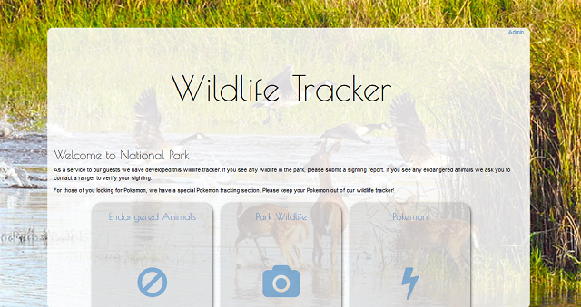
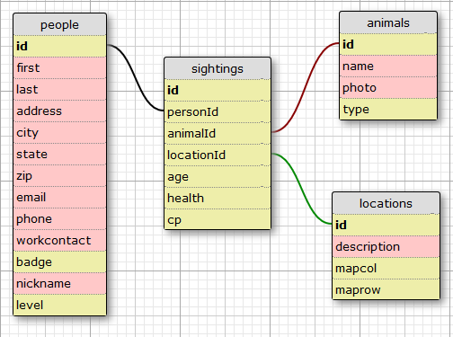

# Wildlife Tracker
Version 0.0.1: September 30, 2016
by [Karen Freeman-Smith](https://karenfreemansmith.github.io)

## Description
Final Project for Week 4, Java at Epicodus. A program to track wildlife sightings using Java, PostgreSQL, and Spark with JUnit tests demonstrating abstract classes, interfaces, many-to-many database relationships and RESTful routing.

## Technologies Used
Java, JUnit, Spark, PostgreSQL, Gradle

## Setup/Installation
* Clone directory
* Setup database in PSQL:
  * CREATE DATABASE wildlife_tracker;
  * \c wildlife_tracker
  * CREATE TABLE animals (id serial PRIMARY KEY, animalName varchar, photo varchar, type int);
  * CREATE TABLE sightings (id serial PRIMARY KEY, animalId int, personId int, locationId int, time timestamp, age int, health int, cp int);
  * CREATE TABLE people (id serial PRIMARY KEY, firstname varchar, lastname varchar, phonenumber varchar, address varchar, city varchar, state varchar, zip varchar, email varchar, badge int, workcontact varchar, trainerName varchar, level int, type int);
  * CREATE TABLE locations (id serial PRIMARY KEY, description varchar, maprow int, mapcol int);
  * CREATE DATABASE wildlife_tracker_test WITH TEMPLATE wildlife_tracker;
* OR ... restore database from backup by running
  * CREATE DATABASE wildlife_tracker;
  * psql wildlife_tracker < wildlife.sql
  * CREATE DATABASE wildlife_tracker_test;
  * psql wildlife_tracker_test < wildlife.sql
* Type 'gradle run' inside the project directory
* Navigate to 'http://localhost:4567'

## Support & Contact
For questions, concerns, or suggestions please email karenfreemansmith@gmail.com

## Specifications
### User Stories:
* As a supervisor, I can add/edit/delete animals.
* As a supervisor, I can add/edit/delete locations.
* As a supervisor, I can add/edit rangers. (Rangers should not be deleted)
* As a supervisor, I can view a page that lists all sightings by a specified ranger.
* As a park ranger, I need to be able to enter sightings of wildlife that include the location and type of animal.
* As a park ranger, I will get an error if I don't include age or health for endangered animals.
* As a park ranger, I need to indicate age and health for endangered animals.
* As a park visitor, I can enter animal sightings.
* As a park visitor, I will get an error if I try to enter an endangered animal.
* As a pokemon trainer, I can enter pokemon sightings.
* As a website user, I can view a page that lists all sightings sorted by most recent (default/home page)
* As a website user, I can view a page that lists all sightings in a certain location.
* As a website user, I can view a page that lists all sightings for a specified animal.

### Database Diagram:

### Technical Specifications:
| _Behavior_ | _Input_ | _Output_ |
|:---------------------------------------------------------------------:|:---------------------------------------------------------------------------:|:-------------------------------------------------------------------------------------------------------------------:|
| Store Animal Types | "Bear" | "Bear" |
| Store Optional Photo | "image.jpg" | "image.jpg" |
| Photo is optional | null | doesn't crash |
| Animal type | 1/2/3 | normal/endangered/pokemon |
| Store Animal Age if endangered | "adult" | "adult" |
| Store Animal Health if endangered | "sick" | "sick" |
| Store Animal CP if pokemon | 412 | 412 |
| Store Location | "near campsite" | "near campsite" |
| Store Optional Map Grid | 1,2 | 1,2 |
| Store Ranger Name | "Ranger Smith", badge 2345, ranger@park.com | "Ranger Smith", 2345, "ranger@park.com |
| Allow Park Visitors to record sightings | "joe@smith.com", 1, 2 | "joe@smith.com", 1, 2 |
| Visitors get error if they sight an endangered animal | animal(2) | "This animal is endangered, please contact park ranger to verify sighting" |
| Allow Pokemon Trainers to record pokemon sightings | 1,2 | "PicinicBasket", 1,2 |
| Record Sightings with Timestamp | '2016-10-01 15:13' | '2016-10-01 15:13' |
| Sightings link to animal | sighting(1) | animal(1) |
| Sightings link to location | sighting(1) | location(1) |
| returns all sightings | n/a | list of sightings |
| returns sightings by location | location(1) | list of sightings |
| returns sightings by ranger | ranger(1) | list of sightings |
| returns sightings by animal | animal(1) | list of sightings |

## Known Issues
* Pages listing animals or sightings load extremely slow
* Getting some duplicate entries on sightings for no apparent reason (extended classes only)
* Broken attempt(s) to join tables and sort Pokemon from real animals - both show where only one is wanted

## Legal
*Licensed under the GNU General Public License v3.0*

Copyright (c) 2016 Copyright _[Karen Freeman-Smith](https://karenfreemansmith.github.io)_ All Rights Reserved.
